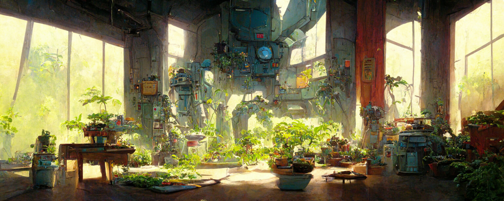
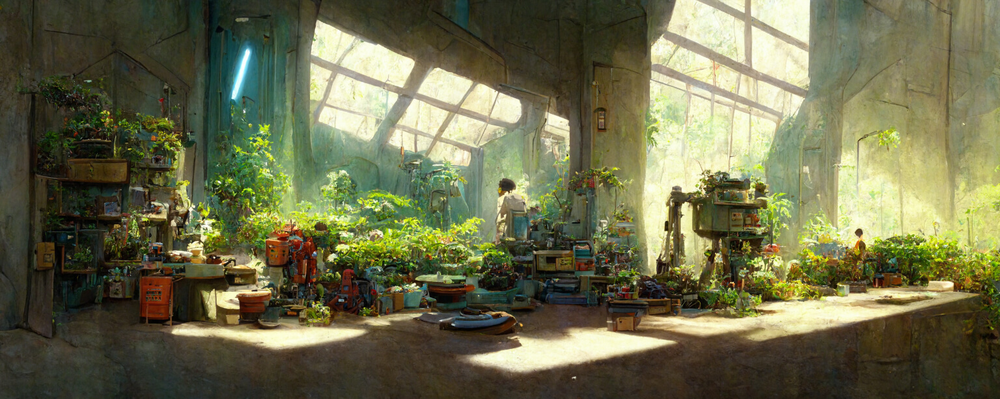

<p align="center">
  
</p>

# dotfiles

Scripts, CLIs and configuration used for my development environment.

## Install

```bash
make setup
```

Clone/download the repo, create symlinks, and set macOS system preferences.

## VS Code (Cursor) Extensions

This is now managed via the [`Brewfile`](./Brewfile) and `hops` bash function (see
[.functions](./.functions)).

## HomeBrew Package Syncing

This is also now managed via the [`Brewfile`](./Brewfile) and `hops` bash function (see
[.functions](./.functions)).

## Thanks

- Jeff Geerling - [geerlingguy/dotfiles](https://github.com/geerlingguy/dotfiles)
- Marko Wallin - [walokra/dotfiles](https://github.com/walokra/dotfiles)
- Mathias Bynens - [mathiasbynens/dotfiles](https://github.com/mathiasbynens/dotfiles)
- [Christopher Allen](https://github.com/ChristopherA) for his
  [gist](https://gist.github.com/ChristopherA/a579274536aab36ea9966f301ff14f3f) on Brewfile best
  practices.

---

<p align="center">
  
</p>
